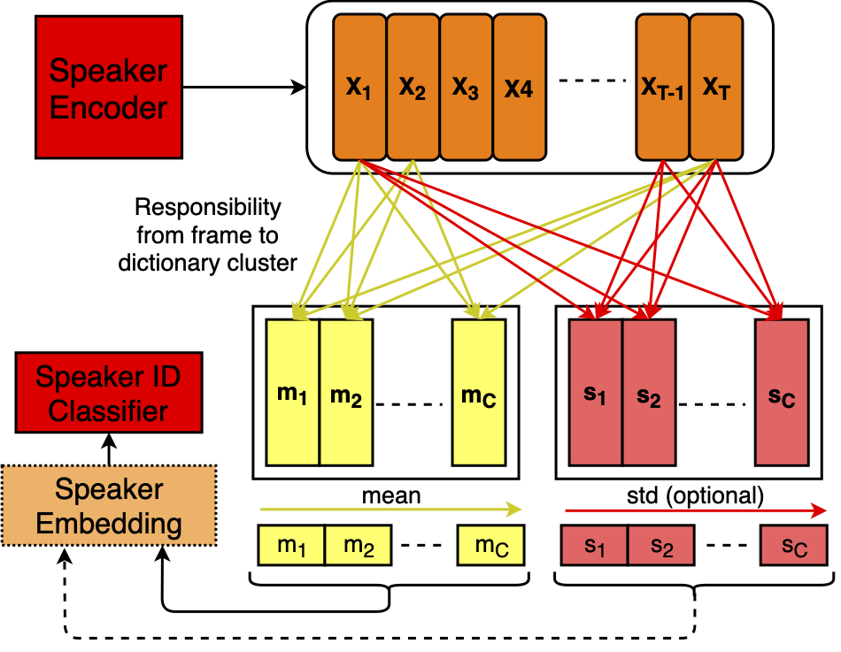
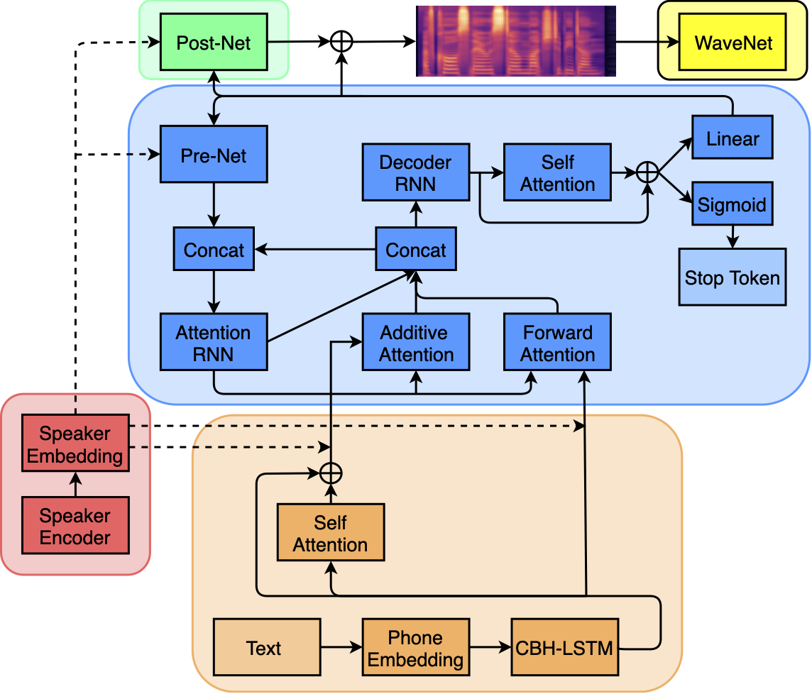
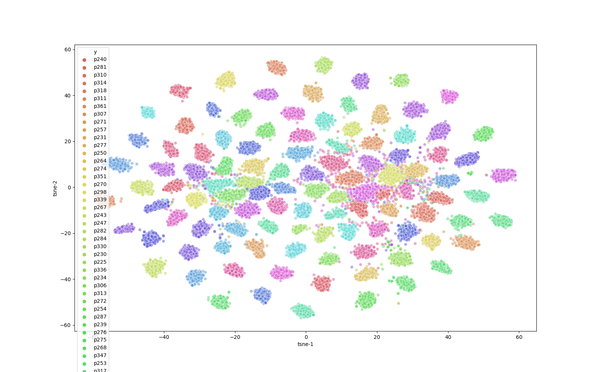
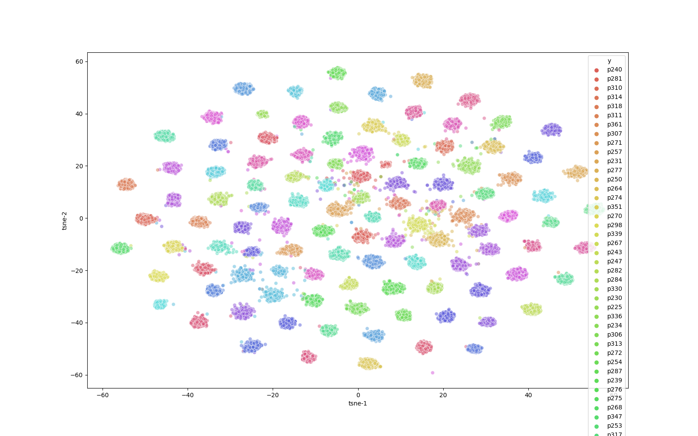

# pytorch-kaldi-neural-speaker-embeddings
**A light weight neural speaker embeddings extraction based on Kaldi and PyTorch.** \
The repository serves as a starting point for users to reproduce and experiment several recent advances in speaker recognition literature. 
Kaldi is used for pre-processing and post-processing and PyTorch is used for training the neural speaker embeddings.
**I want to note that this repo is not meant for keeping track of state-of-the-art on speaker recognition, and most likely the models will be considered outdated in a few months (or sooner :().** 

This repository contains a PyTorch+Kaldi pipeline to reproduce the core results for: 
* [Exploring the Encoding Layer and Loss Function in End-to-End Speaker and Language Recognition System](https://arxiv.org/pdf/1804.05160.pdf)
* [A Novel Learnable Dictionary Encoding Layer for End-to-End Language Identification](https://ieeexplore.ieee.org/stamp/stamp.jsp?tp=&arnumber=8462025)

With some modifications, you can easily adapt the pipeline for:
* [Angular softmax for short-duration text-independent speaker verification](https://pdfs.semanticscholar.org/93f9/24fa3d9920edc10469b04c90960c03dce856.pdf)
* [Utterance-level aggregation for speaker recognition in the wild](https://arxiv.org/pdf/1902.10107.pdf)
* [Margin Matters: Towards More Discriminative Deep Neural Network Embeddings for Speaker Recognition](https://arxiv.org/pdf/1906.07317.pdf)
* [Spatial Pyramid Encoding with Convex Length Normalization for Text-Independent Speaker Verification](https://arxiv.org/pdf/1906.08333.pdf)

If one wants to go further, take a look at our recent work on [multi-speaker text-to-speech](https://arxiv.org/pdf/1910.10838.pdf), where the same speaker embeddings are employed to model speaker characterisitcs in a text-to-speech system. 

Lastly, kindly cite our paper(s) if you find this repository useful. Cite both if you are kind enough!
```
@article{villalba2019state,
  title={State-of-the-art speaker recognition with neural network embeddings in nist sre18 and speakers in the wild evaluations},
  author={Villalba, Jes{\'u}s and Chen, Nanxin and Snyder, David and Garcia-Romero, Daniel and McCree, Alan and Sell, Gregory and Borgstrom, Jonas and Garc{\'\i}a-Perera, Leibny Paola and Richardson, Fred and Dehak, R{\'e}da and others},
  journal={Computer Speech \& Language},
  pages={101026},
  year={2019},
  publisher={Elsevier}
}
```
```
@article{cooper2019zero,
  title={Zero-Shot Multi-Speaker Text-To-Speech with State-of-the-art Neural Speaker Embeddings},
  author={Cooper, Erica and Lai, Cheng-I and Yasuda, Yusuke and Fang, Fuming and Wang, Xin and Chen, Nanxin and Yamagishi, Junichi},
  journal={arXiv preprint arXiv:1910.10838},
  year={2019}
}
```

One should also check out the very nicely written [TensorFlow version](https://github.com/mycrazycracy/tf-kaldi-speaker) by [Yi Lu](http://yiliu.org.cn).

# Overview
Neural speaker embeddings: Encoder --> Pooling --> Classification 
LDE pooling method illustration:
<p align="center">
 
</p>

# Requirements
`pip install -r requirements.txt`
Please also [download and properly setup Kaldi](https://kaldi-asr.org/doc/install.html). If you are stuck in this phase, this repository is liekly not for you. 

# Getting Started 
The bash file `pipeline.sh` contains the 12-stage speaker recognition pipeline, including feature extraction, the neural model training and decoding/evaluation. A more detailed description of each step is described in `pipeline.sh`. To get started, simply run: 
`./pipeline.sh`

# Datasets 
The models are trained on [VoxCeleb I+II](http://www.robots.ox.ac.uk/~vgg/data/voxceleb/), which is free for downloads (the trial lists are also there). One can easily adapt `pipeline.sh` for different datasets.

# Pre-Trained Models 
Due to Youtube's privacy policy, unfortunately I am not allowed to upload pre-trained models for VoxCeleb I+II. 

# Benchmarking Speaker Verification EERs

|     Embedding name       |  dimension | normalization|   pooling type |  train objective   |    EER      |  DCF<sup>min</sup><sub>0.01</sub> |
| :-----------------------:| :--------: | :----------: | :------------: | :----------------: | :---------: |  :---------: |
|    i-vectors             |      400   |   no         |     mean       |      EM            |    5.329    |  0.493       |
|    x-vectors             |      512   |   no         |     mean, std  |      Softmax       |    3.298    |  0.343       |
|    x-vectors<sup>N</sup> |      512   |   yes        |     mean, std  |      Softmax       |    3.213    |  0.342       |
|    LDE-1                 |      512   |   no         |     mean       |      Softmax       |    3.415    |  0.366       |
|    LDE-1<sup>N</sup>     |      512   |   yes        |     mean       |      Softmax       |    3.446    |  0.365       |
|    LDE-2                 |      512   |   no         |     mean       |      ASoftmax (m=2)|    3.674    |  0.364       |
|    LDE-2<sup>N</sup>     |      512   |   yes        |     mean       |      ASoftmax (m=2)|    3.664    |  0.386       |
|    LDE-3                 |      512   |   no         |     mean       |      ASoftmax (m=3)|  **3.033**  |**0.314**     |
|    LDE-3<sup>N</sup>     |      512   |   yes        |     mean       |      ASoftmax (m=3)|    3.171    |  0.327       |
|    LDE-4                 |      512   |   no         |     mean       |      ASoftmax (m=4)|    3.112    |  0.315       |
|    LDE-4<sup>N</sup>     |      512   |   yes        |     mean       |      ASoftmax (m=4)|    3.271    |  0.327       |
|    LDE-5                 |      256   |   no         |     mean       |      ASoftmax (m=2)|    3.287    |  0.343       |
|    LDE-5<sup>N</sup>     |      256   |   yes        |     mean       |      ASoftmax (m=2)|    3.367    |  0.351       |
|    LDE-6                 |      200   |   no         |     mean       |      ASoftmax (m=2)|    3.266    |  0.396       |
|    LDE-6<sup>N</sup>     |      200   |   yes        |     mean       |      ASoftmax (m=2)|    3.266    |  0.396       |
|    LDE-7                 |      512   |   no         |     mean, std  |      ASoftmax (m=2)|  **3.091**  |**0.303**     |
|    LDE-7<sup>N</sup>     |      512   |   yes        |     mean, std  |      ASoftmax (m=2)|    3.171    |  0.328       |

# Using Speaker Embeddings for Tacotron2 Speaker Adaptation
<p align="center">
 
</p>

# Speaker Embedding Space Visualization (cluster by speakers)

**i-vectors (baseline)**
<p align="center">
 
</p>

**LDE** 
<p align="center">
 
</p>

# Benchmarking TTS MOS scores

|     Embedding name       | Naturalness dev | Naturalness test | Similarity dev | Similarity test |
| :-----------------------:| :-------------: | :--------------: | :------------: | :-------------: |
|    vocoded               |      3.41       |       3.55       |      2.79      |       2.82      |
|    x-vectors<sup>N</sup> |      3.19       |       3.19       |      1.86      |       2.37      | 
|    LDE-1                 |      3.16       |       3.21       |    **2.05**    |       2.34      |
|    LDE-1<sup>N</sup>     |      3.13       |       3.46       |      1.97      |       2.45      |
|    LDE-2                 |      3.28       |       3.35       |      2.00      |       2.37      |
|    LDE-2<sup>N</sup>     |      3.19       |       3.33       |      2.00      |       2.35      |
|    LDE-3                 |      3.24       |     **3.48**     |      1.88      |     **2.46**    |
|    LDE-3<sup>N</sup>     |      3.16       |       3.33       |      2.00      |       2.37      |
|    LDE-4                 |      3.10       |       3.29       |      2.00      |       2.31      |
|    LDE-4<sup>N</sup>     |      3.20       |       3.29       |      1.98      |       2.39      |
|    LDE-5                 |      3.26       |       3.40       |      1.99      |       2.45      |
|    LDE-5<sup>N</sup>     |      3.07       |       3.37       |      2.02      |       2.41      |
|    LDE-6                 |      3.25       |       3.33       |      1.95      |       2.43      |
|    LDE-6<sup>N</sup>     |    **3.29**     |       3.23       |      1.94      |       2.39      |
|    LDE-7                 |      3.03       |       3.18       |      1.86      |       2.28      |
|    LDE-7<sup>N</sup>     |      3.02       |       3.24       |      2.02      |       2.42      |

# Credits
Base code written by [Nanxin Chen](https://github.com/bobchennan), Johns Hopkins University \
Experiments done by [Cheng-I Lai](http://people.csail.mit.edu/clai24/), MIT
